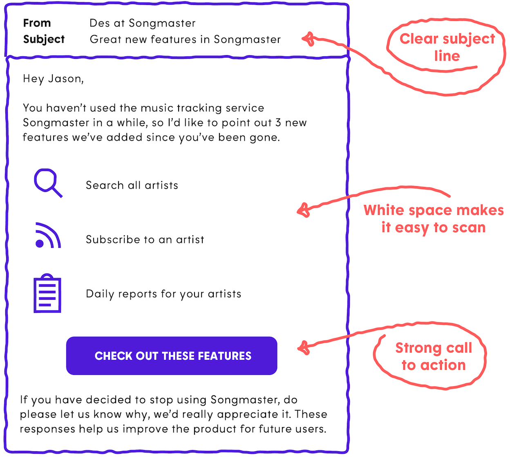

This is where having a solid [customer engagement](https://www.intercom.com/customer-engagement) strategy comes in. This means crafting a message strategy that truly engages its recipients on a regular basis, creating an outstanding customer experience.

Creating a great strategy is one thing, but implementing it is another – that’s why we recently released [Series](https://www.intercom.com/series), a visual orchestration tool to easily create powerful, behavior-based customer messaging campaigns. With Series, [it’s never been easier](https://www.intercom.com/blog/announcing-series-visual-campaign-builder/) to send the right message to the right person and at the right time.

Thank you!